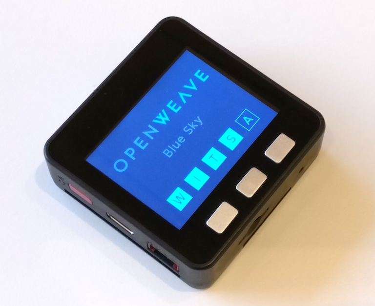

# OpenWeave ESP-32 Demo

A simple demo application showing how to build and use OpenWeave on the Espressif ESP32.

[OpenWeave](http://openweave.io/) is the open source release of Nest's Weave technology, the application layer framework that provides a secure, reliable
communications backbone for Nest's products.
___

- [Supported Devices](#supported-devices)
- [Building the Demo Application](#building-the-demo-application)
- [Pairing](#pairing) 
- [Developer Resources](#developer-resources)

___

## Supported Devices

The OpenWeave demo application currently works on two categories of ESP32 devices: the [ESP32-DevKitC](https://www.espressif.com/en/products/hardware/esp32-devkitc/overview), and the [M5Stack](http://m5stack.com). 

#### ESP32-DevKitC

The ESP32-DevKitC is a small development board containing an ESP-WROOM-32 module plus a power regulator and a Silicon Labs CP2102 USB-to-UART bridge.
The board provides a USB connector for power and host connectivity, two buttons (one for reset and a second for general input) and two LEDs (power and general output).

There are a large number of clone boards manufactured by various third-party companies, many of which can be found on Amazon.     Of these, the HiLetgo ESP-WROOM-32 ESP-32S
development board is one that is known to work and is available for a very reasonable price. 

You can find a schematic for the ESP32-DevKitC [here](https://dl.espressif.com/dl/schematics/ESP32-Core-Board-V2_sch.pdf).

#### M5Stack

The [M5Stack](http://www.m5stack.com) is a modular IoT development platform consisting of an ESP32-D0WDQ6  module and an integrated ILI9341 TFT LCD screen (320x240 resolution).  The M5Stack
includes a USB-C interface, an integrated speaker and audio output circuit, a TF-CARD reader, a 150mAh battery, and a set of general purpose buttons.  The M5Stack can be
extended by adding (stacking) various expansion modules, including modules for GSM, LORA, GPS and a larger battery.

You can find a schematic for the M5Stack core [here](http://www.m5stack.com/download/M5-Core-Schematic(20171206).pdf).

 

___

## Building the Demo Application

Building the demo application requires the use of the Espressif ESP32 IoT Development Framework and the xtensa-esp32-elf toolchain.
To install these components and build the application, follow these steps:

* Clone the Expressif ESP-IDF and checkout version 3.0

        $ mkdir ${HOME}/tools
        $ cd ${HOME}/tools
        $ git clone https://github.com/espressif/esp-idf.git
        $ cd esp-idf
        $ git checkout release/v3.0
        $ git submodule update --init

* Download and install the appropriate xtensa ESP32 gnu tool chain (ESP-IDF v3.0 requires tool chain version [1.22.0-80-g6c4433a-5.2.0](https://dl.espressif.com/dl/xtensa-esp32-elf-linux64-1.22.0-80-g6c4433a-5.2.0.tar.gz))

        $ cd ${HOME}/tools
        $ wget https://dl.espressif.com/dl/xtensa-esp32-elf-linux64-1.22.0-80-g6c4433a-5.2.0.tar.gz
        $ tar xzvf xtensa-esp32-elf-linux64-1.22.0-80-g6c4433a-5.2.0.tar.gz

* Clone the demo application repository and fetch the referenced submodules.

        $ mkdir ${HOME}/projects
        $ cd ${HOME}/projects
        $ git clone https://github.com/openweave/openweave-esp32-demo.git
        $ cd openweave-esp32-demo
        $ git submodule update --init

* Within the demo source directory, create a shell script called `setup.sh` containing paths to the ESP-IDF  and the xtensa toolchain directories created above.

        :
        export IDF_PATH=${HOME}/tools/esp-idf
        export ESP32_TOOLS_BIN=${HOME}/tools/xtensa-esp32-elf/bin
        export PATH=${ESP32_TOOLS_BIN}:${PATH}
    
* Source the setup.sh script

        . setup.sh

* In the root of the  source directory, use the `menuconfig` make target to configure the application.

        $ cd ${HOME}/projects/openweave-esp32-demo
        $ make menuconfig

 * Within the configuration tool, set the following build-time options for your device:

| _Config Setting_ | _Value_ |
| ----------------------- | ---------- |
| **OpenWeave&nbsp;ESP32&nbsp;Demo&nbsp;> &nbsp;&nbsp;Device&nbsp;Type** | Select either `M5Stack` or `ESP32-DevKitC`, depending on the type of your device.|
| **Component&nbsp;Config&nbsp;> &nbsp;&nbsp;OpenWeave&nbsp;Device&nbsp;Layer&nbsp;> &nbsp;&nbsp;&nbsp;&nbsp;Testing&nbsp;Options&nbsp;> &nbsp;&nbsp;&nbsp;&nbsp;&nbsp;&nbsp;Use&nbsp;Test&nbsp;Device&nbsp;Identity** | Choose a unique number between 1 and 255 for your device. This number will become the last byte in the device id for your device - e.g. a value of `15` will result in a device id of `18B430000000000F`. To avoid  confusion, the number chosen must be unique for all devices on your network, as well as all devices that connect to the same  service.|
    
* Run make to build the demo application

        make

* Connect your device via USB. Then run the following command to flash the demo application onto the device and then monitor its output.
If necessary, replace `/dev/ttyUSB0` with the correct USB device name for your system.

      make flash monitor ESPPORT=/dev/ttyUSB0

 

___

## Pairing

The device can be paired via either BLE (using Weave-over-BLE) or via the device's WiFi soft-AP.

Upon boot, if the device detects is has not been fully provisioned, it will automatically enable its soft-AP.  By default, the SSID for
the device's soft-AP is the string `NEST-xxxx`, where the trailing characters are the last four hex digits of the device's *WiFi* MAC
address.  One can inspect device log output to see the device's SSID, which is printed whenever it enables the soft-AP.

When BLE support is enabled (the default), the device will periodically send BLE advertisements that are compatible with the Nest BLE
advertising format.  By default, the device's BLE device name is `Nxxxx`, where the trailing characters are the last four hex digits of the
device's Weave node id.

The OpenWeave demp app supports all the necessary Weave profiles to enable full device pairing, including Network Provisioning,
Fabric Provisioning, Service Provisioning, Device Identity and Device Control. 

#### Pairing Code

By default, the demo application uses the pre-defined pairing code `NESTUS`. This can be overridden by changing the
**Component config > OpenWeave Device Layer > Testing Options > Use Test Device Identity** config setting.

#### QR Code

On devices with a screen, pressing the attention button (the right button on the M5Stack) while the device is in an unpaired state will cause it
to display its pairing code and corresponding QR code.  The pairing screen remains active until a PASE session is established with the device, or the attention button is pressed again.  

 

___

## Reset to Defaults

Pressing and holding the attention button for 5 seconds will cause the device to wipe its configuration and reboot.  On devices with a screen, a countdown screen
is displayed showing the time remaining before the reboot.

 

___

## Developer Resources

Documentation for Expressif's ESP-32 development environment can be found here: [ESP-IDF Programming Guide](http://esp-idf.readthedocs.io/en/latest/index.html).

Instructions for building and incorporating OpenWeave into a new ESP32 project can be found here: [Building OpenWeave for the ESP32](https://github.com/openweave/openweave-core/blob/master/BUILDING-ESP32.md).
